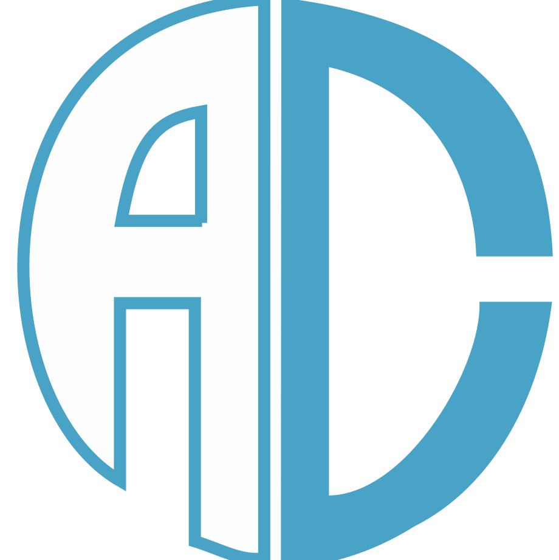

<a name="readme-top"></a>

  <!-- PROJECT SHIELDS -->

[![Contributors][contributors-shield]][contributors-url]
[![Forks][forks-shield]][forks-url]
[![Stargazers][stars-shield]][stars-url]
[![Issues][issues-shield]][issues-url]
[![MIT License][license-shield]][license-url]
[![LinkedIn][linkedin-shield]][linkedin-url]
[![Visitors][visitors-shield]]

  <!-- PROJECT LOGO -->

  <br />
  <div align="center">
     <a href="https://github.com/anc141/my-portfolio-main">
      
    </a>
    <h1 align="center">amolnchaudhari.com</h1>
    <p align="center">
    <br/>
Crafting Connections through Code: Explore my journey, projects, and passions in this immersive portfolio powered by React.<br/>
      <br/>
      Built by: Amol Chaudhari
      <br/>
      <br/>
      <a href="https://github.com/anc141/my-portfolio-main"><strong>Explore the docs »</strong></a>
      <br/>
      <br/>
      <a href="https://amolnchaudhari.com">View Live Website</a>
      ·
      <a href="https://github.com/anc141/my-portfolio-main/issues">Request Feature</a>
    </p>
  </div>
  
  <!-- TABLE OF CONTENTS -->

  <details>
    <summary>Table of Contents</summary>
    <ol>
      <li>
        <a href="#about-the-project">About The Project</a>
        <ul>
          <li><a href="#photos">Photos</a></li>
          <li><a href="#built-with">Built With</a></li>
          <li><a href="#description">Description</a></li>
        </ul>
      </li>
      <li>
          <a href="#getting-started">Getting Started</a>
        <ul>
          <li><a href="#prerequisites">Prerequisites</a></li>
          <li><a href="#installation">Installation</a></li>
        </ul>
      </li>
      <li><a href="#license">License</a></li>
      <li><a href="#questions">Questions</a></li>
    </ol>
  </details>
  
  <!-- ABOUT THE PROJECT -->
  
  ## About The Project
  
  ### Photos
  
[![My React Portfolio Screen Shot][product-screenshot]](https://amolnchaudhari.com)

[![My React Portfolio Screen Shot][product-screenshot2]](https://amolnchaudhari.com)

[![My React Portfolio Screen Shot][product-screenshot3]](https://amolnchaudhari.com)

[![My React Portfolio Screen Shot][product-screenshot4]](https://amolnchaudhari.com)

  <p align="right"><a href="#readme-top">back to top</a></p>
  
  ### Built With
  
  

  <p align="right"><a href="#readme-top">back to top</a></p>
  
  ### Description

This portfolio isn’t just a collection of my work; it’s an invitation to explore, learn, and connect. Dive in and enjoy the journey.

Inspiration and Attribution
While I encourage you to draw inspiration from my portfolio for your own creative projects, I kindly ask that you credit <strong>amolnchaudhari.com</strong>. Acknowledging the source is a gesture of fairness and appreciation for the effort behind this portfolio.

Respecting Originality
Please refrain from presenting this portfolio or any of its projects as your own creation. The time and energy I’ve invested in crafting this portfolio reflect my personal journey and ambitions.

Gratitude and Community
Thank you for understanding and for embracing the values of creativity, authenticity, and mutual respect that our digital community thrives on. Your acknowledgment is greatly appreciated!

Show Your Support
If you like what you see, I’d be grateful if you considered giving it a star 🌟.

Feel free to fork this repo for your own purposes, provided you give me credit.

  <p align="right"><a href="#readme-top">back to top</a></p>
 

<!-- GETTING STARTED -->

## Getting Started

To get a local copy up and running follow these simple example steps.

### Prerequisites

- npm
  ```sh
  npm install npm@latest -g
  ```

### Installation

1. Clone the repo
   ```sh
   git clone  https://github.com/anc141/my-portfolio-main.git
   ```
2. Install NPM packages
   ```sh
   npm install
   ```

  <p align="right"><a href="#readme-top">back to top</a></p>
  
 
  <!-- LICENSE -->

## License

Distributed under the MIT License. See `LICENSE.md` for more information.

  <p align="right"><a href="#readme-top">back to top</a></p>
  
  
<!-- QUESTIONS -->
  
## Questions

If you have any inquiries, don't hesitate to reach out to me via socials or by sending an email to <a href="mailto:amolchaudhari141@gmail.com">Amol</a>

<a href="https://www.linkedin.com/in/amolnchaudhari/">LinkedIn</a> | <a href="https://github.com/anc141/">GitHub</a>

Project Link: [https://github.com/anc141](https://github.com/anc141)

  <p align="right"><a href="#readme-top">back to top</a></p>
  
  <!-- MARKDOWN LINKS & IMAGES -->

[contributors-shield]: https://img.shields.io/github/contributors/anc141/my-portfolio-main.svg?style=for-the-badge
[contributors-url]: https://github.com/anc141/my-portfolio-main/graphs/contributors
[forks-shield]: https://img.shields.io/github/forks/anc141/my-portfolio-main.svg?style=for-the-badge
[forks-url]: https://github.com/anc141/my-portfolio-main/network/members
[stars-shield]: https://img.shields.io/github/stars/anc141/my-portfolio-main.svg?style=for-the-badge
[stars-url]: https://github.com/anc141/my-portfolio-main/stargazers
[issues-shield]: https://img.shields.io/github/issues/anc141/my-portfolio-main.svg?style=for-the-badge
[issues-url]: https://github.com/anc141/my-portfolio-main/issues
[license-shield]: https://img.shields.io/github/license/anc141/my-portfolio-main.svg?style=for-the-badge
[license-url]: https://github.com/anc141/my-portfolio-main/blob/main/LICENSE.md
[linkedin-shield]: https://img.shields.io/badge/-LinkedIn-black.svg?style=for-the-badge&logo=linkedin&colorB=555
[linkedin-url]: https://linkedin.com/in/amolnchaudhari
[visitors-shield]:https://hits.dwyl.com/username/repository.svg?style=for-the-badge
<!-- [vistiors-url]: -->

  <!-- UPDATE PLACEHOLDER IMAGES HERE -->

[product-screenshot]: src/images/Screenshot.jpeg
[product-screenshot2]: src/images/Screenshot2.jpeg
[product-screenshot3]: src/images/Screenshot3.jpeg
[product-screenshot4]: src/images/Screenshot4.jpeg
[responsive-screenshot]: src/images/mobile-screenshot.png
[responsive-screenshot2]: src/images/mobile-screenshot2.png
[responsive-screenshot3]: src/images/mobile-screenshot3.png
[responsive-screenshot4]: src/images/mobile-screenshot4.png
